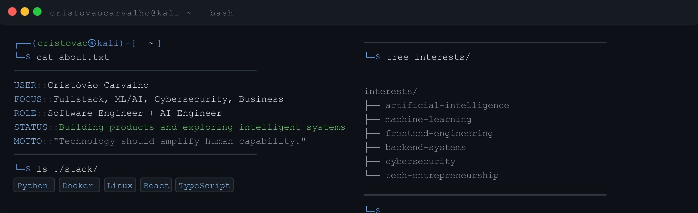

 

<h2 align="center">  <em>About  me </em></h2>

  

 
<h2 align="center">  <em> Technologies </em> </h2>

<h4 align="center""> <em> Extra </em> </h2>

  
  
  
  
  
  
  
  
  
  
  
  
  
  
  
  
  
  
  
  
  
  
  
  
  
  
  
  
  
  
  
  
  
  

<h2 align="center"">  <em> Statistics </em> </h2>

 

